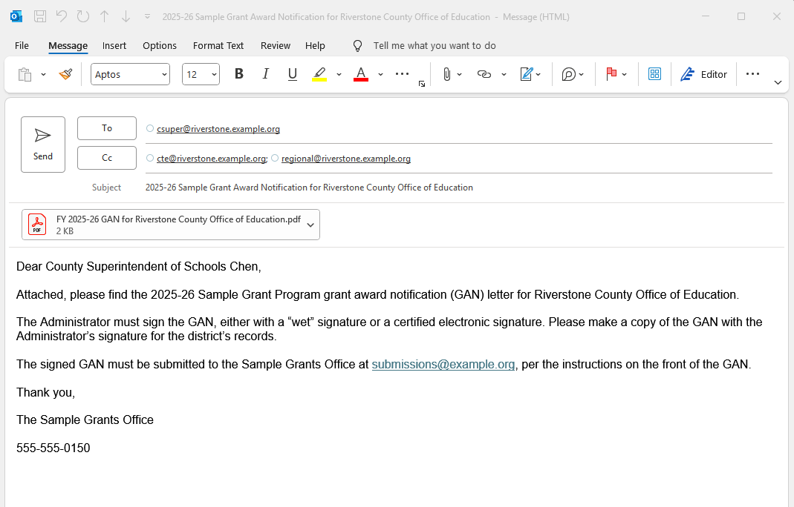
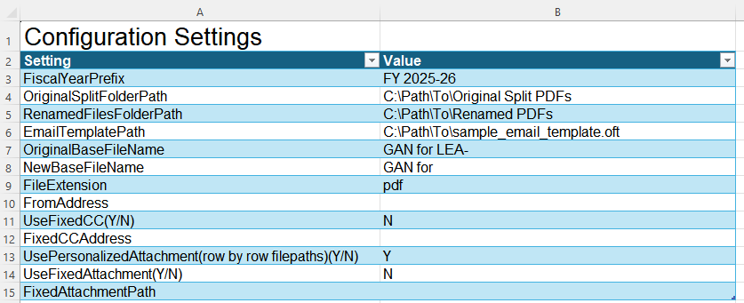
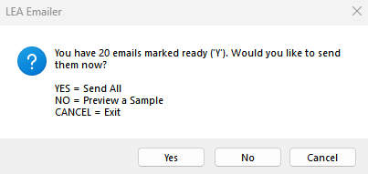
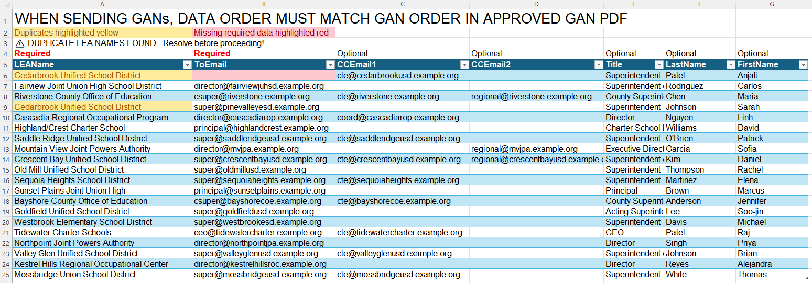
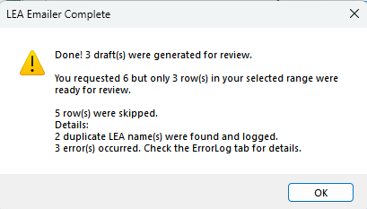
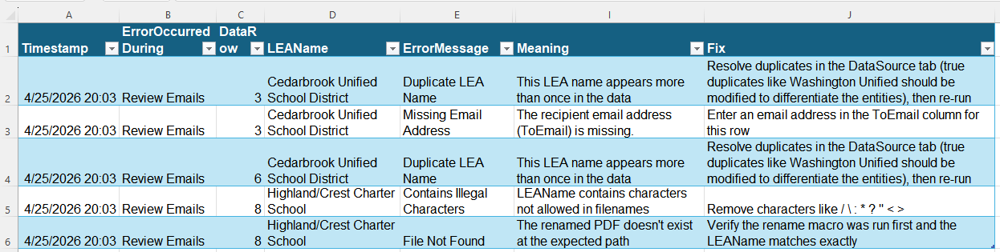

# LEA Emailer

A configurable Excel-based mail-merge tool for sending personalized emails with optional attachments to Local Educational Agencies (LEAs), built in VBA for direct integration with Microsoft Outlook.

## What it does

Reads a list of LEA contacts (LEA name, recipient email, optional CC addresses, recipient name and title) and uses Outlook to send personalized emails based on an .oft template. Supports per-LEA personalized PDF attachments, split from a single source PDF (such as a multi-LEA grant award notification, or "GAN") and automatically renamed via a companion macro so each LEA receives only their own document.



*Preview mode: a draft email auto-generated by the `EmailLEAs` macro from one row of SourceData. Subject, To, CC, attachment, and body are all personalized: the `{leaname}`, `{title}`, and `{lastname}` placeholders have been substituted with the row's values, and the attachment filename matches the LEA's renamed PDF.*

The tool includes two macros that can be used independently or chained:

- **`RenameGANs`**: copies a folder of split PDFs and renames each one to include the relevant LEA's name, producing a personalized set ready for distribution.
- **`EmailLEAs`**: sends or previews emails using the configured Outlook template, with optional fixed and/or per-LEA attachments, comprehensive validation, and a structured error log.

## Why VBA

The natural question for a project like this is *"why not Python with the Microsoft Graph API?"* The answer is deployment context.

This tool was built for an organizational environment where:

- Users live in Excel and Outlook for their daily work.
- IT approval is required for new applications, but Excel macros run inside an already-approved environment.
- Email must be sent through the user's authenticated Outlook session, meaning the user's identity, organizational mail rules, and audit trail all apply automatically. Sending via an external API would mean the tool would need its own credentials that an organization's security team would have to vet, approve, and maintain, which is a high bar for what is essentially a productivity script.
- Distribution happens via a shared network drive: no installer, no permissions, no version mismatches.

VBA + Outlook automation is the correct match for these constraints. A Python equivalent would be technically more flexible but operationally worse: IT review, credential management, separate authentication, and the loss of natural integration with the user's daily tools.

## Design highlights

The tool was designed for analysts who are not developers, deploying to a small population of users running mail-merges of up to several hundred LEAs at a time. Several design choices reflect that:

**Configuration-driven.** Every behavior (file paths, naming patterns, attachment toggles, fixed CC addresses, sender mailbox) is set on a single Config tab with named settings and inline explanations. No code editing required to adapt the tool to a new project.



*The Config tab. Each setting is named clearly; placeholder values like `C:\Path\To\Original Split PDFs` indicate where the user fills in their own paths. The inline explanations of what each setting does live in the Instructions tab, keeping Config itself uncluttered.*

**In-workbook documentation.** An Instructions tab walks the user through initial setup, configuration, source-data preparation, the Adobe-side PDF splitting step, both macros, the preview and send flows, and re-sending after errors. Designed to be read end-to-end on a user's first encounter and then referenced as needed.

**Critical vs. warning errors.** During the email setup phase, the macro distinguishes between *critical* errors (missing template path, no rows ready to send) that stop execution, and *warnings* (configuration mismatches, optional fields populated when their toggle is off) that surface a summary and let the user choose to proceed. This avoids the "tool refuses to run for trivial reasons" frustration without sacrificing safety.

**Preview mode.** The send dialog offers Yes / No / Cancel: Yes sends, No generates draft emails in Outlook for review without changing the row's status to "Sent", Cancel exits cleanly. Users can preview as many times as they want before committing. Sending email is irreversible; the design respects that.



*The send/preview dialog. Choosing between actually sending and merely previewing is foregrounded as a primary decision, not buried in a setting somewhere. Cancel is always an option for users who want to back out without doing either.*

**Iterative retry workflow.** Each row's `ReadyToSend` column tracks state across runs: `Y` means ready, `N` means skip, `Sent` means already sent (auto-skipped on subsequent runs), `Error` means failed (with details in the ErrorLog tab). Users can fix the cause of an error and change `Error` back to `Y` to retry just the failures, without disturbing successfully-sent rows.

**Defensive validation.** Duplicate LEA names are flagged automatically via an array formula in the Data tab. LEA names containing illegal filename characters (`/ \ : * ? " < > |`) are caught before the rename macro touches the file system. Y/N fields that are blank or contain anything else are reported and treated as `N` with a warning rather than failing silently.



*Validation surfaces issues at data-entry time, not just at runtime. Duplicate LEA names trigger yellow cell highlighting and a conditional banner cell ("DUPLICATE LEA NAMES FOUND - Resolve before proceeding!"). Missing required fields trigger red highlighting. The user sees problems while still typing, when they're easiest to fix.*

**A documented Outlook quirk.** The `.oft` placeholder substitution can fail silently if Outlook has inserted invisible formatting tags inside placeholder text, a known Outlook behavior triggered when users edit placeholders character-by-character. The Instructions tab documents the workaround (delete and re-type the placeholder in a single action), turning a frustrating debugging experience into a documented gotcha.

**Comprehensive error logging.** When something goes wrong, the ErrorLog tab captures *when* (which phase: Email Setup, Send Emails, Review Emails), *where* (which row), *what* (the LEA name and email addresses involved), the *meaning* of the error, and a suggested *fix*. Designed for a non-developer user to self-resolve issues without escalation.



*The post-run summary dialog. Counts of successes, skips, duplicates, and errors are reported up front, with a pointer to the ErrorLog for the user to follow up. The user learns the outcome at a glance and knows exactly where to look next.*



*The ErrorLog from the run shown above. Each entry captures the timestamp, the phase the error occurred during, the data row, the LEA name, the categorical error message, and, most distinctively, a human-readable Meaning and a concrete Fix. Four different error types are shown here in a single run: a duplicate LEA name (logged twice, once for each occurrence), a missing email address, illegal filename characters, and a missing renamed PDF.*

## Repository contents

```
lea-emailer-vba/
├── lea_emailer_template.xlsm     # The tool: VBA modules, Config, Instructions, Data, ErrorLog
├── sample_email_template.oft     # Sample Outlook email template with placeholders
├── email_template_preview.pdf    # Visual preview of the email template
├── sample_lea_contact_list.csv   # 20 fabricated LEAs in a typical contact-export format
├── sample_attachments/
│   ├── unsplit/
│   │   └── FY 2025-26 GAN for LEA-.pdf   # 20-page sample document (one page per LEA)
│   └── split/                            # 20 single-page PDFs ready for the rename macro
├── renamed_attachments/                  # 20 PDFs already renamed (output of running RenameGANs)
└── README.md
```

All sample data is fabricated. LEA names, email addresses, contact names, and document content are placeholders for demonstration purposes; they don't correspond to any real organization. Internal infrastructure references in the Config tab have been replaced with `C:\Path\To\...` style placeholder paths, and all email addresses use `example.org` (a domain reserved by RFC 2606 for documentation).

## Trying it out

Requires Microsoft Excel with macros enabled and Microsoft Outlook configured with at least one account. Windows-only: Outlook automation via VBA is not portable to macOS Outlook.

A full walkthrough is in the Instructions tab inside the workbook itself. The short version of the `EmailLEAs` workflow:

1. Open `lea_emailer_template.xlsm` in Excel and enable macros if prompted.
2. On the Config tab, replace the `C:\Path\To\...` placeholder values with full paths to folders on your machine.
3. Populate the SourceData tab. The included `sample_lea_contact_list.csv` is a typical messy contact-export; selecting just the relevant columns and pasting them into SourceData mirrors the real-world workflow described in the Instructions tab.
4. On the Data tab, set `ReadyToSend` to `Y` for the rows you want to process.
5. Run `EmailLEAs` from View → Macros (or Alt+F8).

For the personalized-attachment workflow, two folders are provided: `sample_attachments/split/` contains pre-split source PDFs ready for `RenameGANs` to process, and `renamed_attachments/` contains the same 20 PDFs already renamed with each LEA's name. Together, they let a reviewer test either macro independently. Run `RenameGANs` to see the rename workflow on the source files, or skip it and use the pre-renamed files directly with `EmailLEAs`.

**One important detail about the rename macro:** split PDFs are mapped to LEAs *by position*. `FY 2025-26 GAN for LEA-1.pdf` becomes the file for row 1 in SourceData, `LEA-2.pdf` becomes row 2, and so on. The `LEA-N` labels are assigned by Adobe in the order each LEA's pages appear in the original combined PDF, so the row order in SourceData must match the page order in that PDF. For example, `LEA-12` has to be row 12, `LEA-7` has to be row 7, and so on. A mismatch produces silently wrong mappings: the right number of files for the right number of LEAs, but the wrong file going to each one. The Instructions tab calls this out in the SourceData section.

## Background

Built in 2025 for use within a state education department's grant-administration workflow, where a several-hundred-LEA grant award notification distribution had previously been done through a much more manual and time-consuming process. Two adjustments came in response to real-world use: duplicate-LEA detection was added after a duplicate caused problems with file renaming, and the Outlook placeholder issue was documented when Preview mode showed that a placeholder was not being replaced as intended.

Published here as a portfolio sample with all organizational data replaced by fabricated equivalents.
